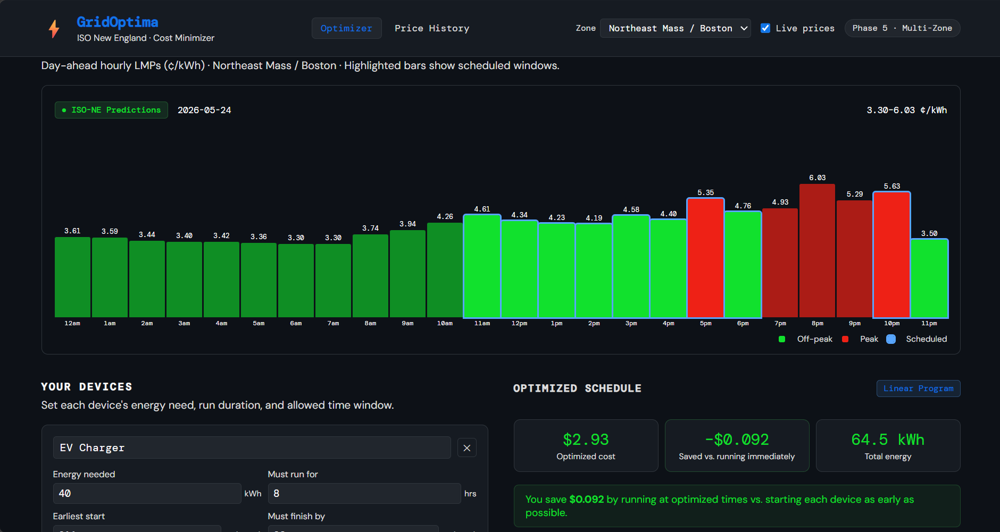
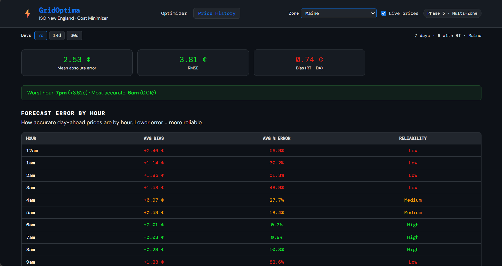
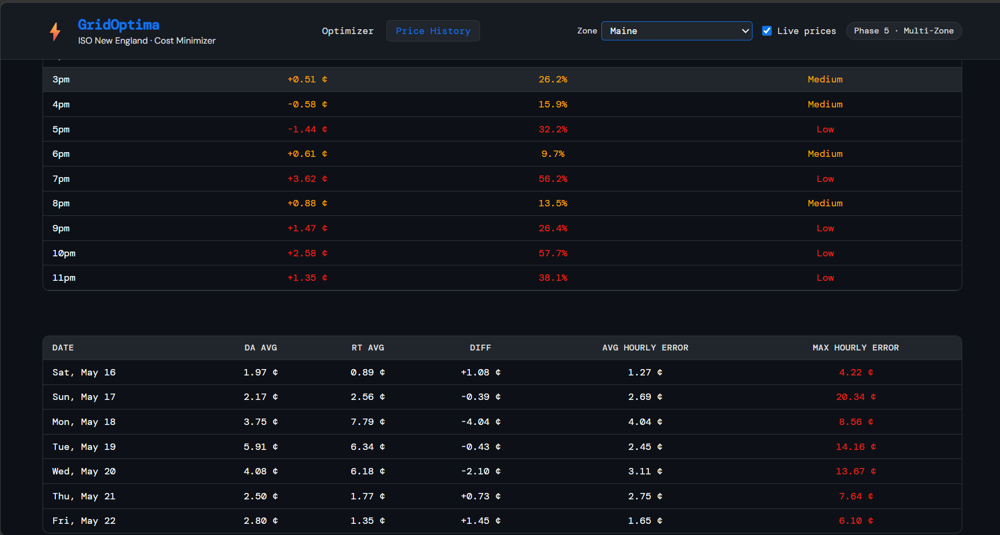

# GridOptima - House Energy Usage Optimizer
Full-stack energy scheduling app. Given your devices and their constraints, finds the cheapest time windows to run them using ISO New England hourly electricity prices. Can also view the price history comparison for day-ahead and actual for the 8 nodes over the past 7, 14, and 30 day periods.

## Quickstart
### Run in 2 separate terminals
### Backend
```bash
cd backend
pip install -r requirements.txt
uvicorn main:app --reload
# http://localhost:8000
# Docs: http://localhost:8000/docs
```

### Frontend
```bash
cd frontend
npm install
npm run dev
# http://localhost:5173
```

## API Reference
```
GET  /health        service status
GET  /prices        hourly electricity prices (¢/kWh)
POST /optimize      optimized device schedule
GET /prices/history see price history
GET /zones          list all ISO-NE load zones
```

## Demo Day-Ahead Optimized Schedule 


## Demo Price History 7 Days

